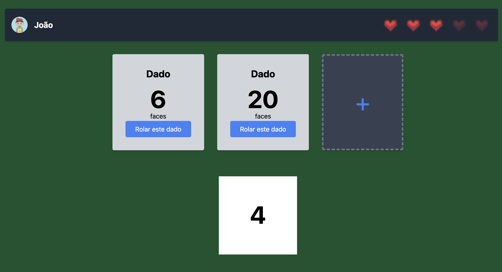
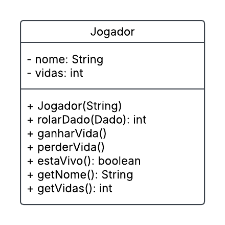

# Projeto Dado Hard

Este é um projeto de exemplo da disciplina de Programação Orientada a Objetos (POO) do SENAC. Neste projeto, são tratados os conceitos de classe, objeto, atributos, métodos e encapsulamento.

## Objetivo do Projeto

O objetivo deste projeto é criar um jogo simples utilizando conceitos de Programação Orientada a Objetos (POO). O jogo envolve um jogador que rola dados e ganha ou perde vidas com base nos resultados dos dados. Este projeto ajuda a entender e aplicar conceitos como classes, objetos, atributos, métodos e encapsulamento.

## Estrutura do Projeto

O projeto é composto pelas seguintes classes principais:

1. **Jogador**: Representa um jogador no jogo. Cada jogador tem um nome e um número de vidas. A classe possui métodos para ganhar e perder vidas, verificar se o jogador está vivo e rolar um dado. O jogador ganha uma vida quando o valor do dado é par e perde uma vida quando o valor é impar. Você deve criar essa classe.

2. **Dado**: Representa um dado que pode ser rolado para obter um número aleatório. A implementação desta classe deve incluir um método `rolar` que retorna um valor entre 1 e 6. Essa classe já está pronta no projeto.

     ```java
     package sp.senac.dado;

     import java.util.Random;

     public class Dado {
          private Random random = new Random();

          public int rolar() {
               return random.nextInt(6) + 1;
          }
     }
     ```

O diagrama a seguir apresenta a classe Jogador com seus atributos e métodos.



## Como Rodar o Projeto Spring

Para rodar o projeto Spring, siga os passos abaixo:

1. **Clone o repositório**:
     ```bash
     git clone <URL_DO_REPOSITORIO>
     cd <NOME_DO_DIRETORIO>
     ```

2. **Compile o projeto**:
     ```bash
     ./mvnw clean install
     ```

3. **Execute a aplicação**:
     ```bash
     ./mvnw spring-boot:run
     ```

4. **Acesse a aplicação**:
     Abra o navegador e acesse `http://localhost:8080`.

## Conclusão

Este projeto serve como uma base para a prática dos conceitos de POO. Complete a implementação da classe `Jogador` e explore os conceitos aprendidos durante a disciplina.
